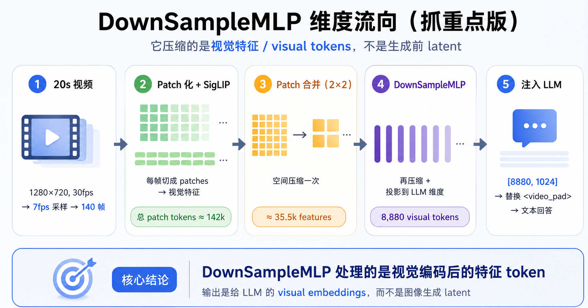

# MiniCPM-V 4.5 / 4.6 架构对比

## 总览

```
MiniCPM-V 4.5 (8.7B, n_embd=4096)
  图像 → Idefics3 Preprocess (scale_resolution=448) → SigLIP ViT (27层) → Resampler → 64 token/tile
  SigLIP: image_size=980, patch_size=14, npps=70, pos_emb=4900

MiniCPM-V 4.6 (1.3B, n_embd=1024)
  图像 → Idefics3 Preprocess (scale_resolution=448) → SigLIP ViT (27层) → vit_merger + merger → ~64 token/tile
  SigLIP: image_size=980, patch_size=14, npps=70, pos_emb=4900
```

> **注意**：V4.5 和 V4.6 的 SigLIP 配置**完全相同**（image_size=980, patch_size=14, 27 层, hidden=1152）。
> 两者的区别在于压缩方式：V4.5 用外部 Resampler（cross-attention），V4.6 用内置 vit_merger + merger.mlp（纯 MLP）。
> 这里的 `image_size=980` 是 SigLIP 位置嵌入表的网格大小（npps=70），与预处理参数 `scale_resolution=448`（控制 tile resize 目标）是不同的东西。

## V4.5 详细管线

```
┌─────────────────────────────────────────────────────────────┐
│ 输入：PIL Image / 视频帧                                    │
│   ↓                                                         │
│ Idefics3 Preprocess (scale_resolution=448, max_slice_nums)  │
│   ↓                                                         │
│ ┌─ SigLIP ViT (27层) ──────────────────────────────────┐    │
│ │  patch_embedding: Conv2d(3→1152, 14×14, stride=14)   │    │
│ │  position_embedding: [4900, 1152]（npps=70, 70²=4900）│    │
│ │  encoder.layers × 27:                                 │    │
│ │    Multi-Head Self-Attention + MLP + LayerNorm         │    │
│ │    （每层 MLP: Linear(1152→4304) → GELU → Linear(4304→1152)）│
│ │  post_layernorm                                        │    │
│ │  输出: [N_patches, 1152]                               │    │
│ └──────────────────────────────────────────────────────┘    │
│   ↓                                                         │
│ ┌─ 3D-Resampler ───────────────────────────────────────┐    │
│ │  kv_proj: Linear(1152 → 4096)                        │    │
│ │  ln_kv: LayerNorm                                     │    │
│ │  + spatial_pos_embeds + temporal_pos_embeds           │    │
│ │  Cross-Attention: 64 query tokens × [N_patches, 4096] │    │
│ │  ln_post → proj: Linear(4096 → 4096)                  │    │
│ │  输出: [64, 4096]（固定 64 token，由可学习 query 数决定）│    │
│ └──────────────────────────────────────────────────────┘    │
│   ↓                                                         │
│ LLM Decoder: Qwen3-8B (llama.cpp GGUF)                      │
│   n_embd=4096, n_vocab=151748, rope_theta=1000000           │
│   max_position_embeddings=40960                              │
└─────────────────────────────────────────────────────────────┘
```

### 关键参数

| 参数 | 值 |
|------|-----|
| SigLIP image_size | 980 |
| patch_size | 14 |
| npps (num_patches_per_side) | 70（980/14） |
| 位置嵌入维度 | 70×70 = 4900 |
| SigLIP 层数 | 27 |
| SigLIP MLP intermediate_size | 4304 |
| SigLIP 输出维度 | 1152 |
| Resampler 输出维度 | 4096 |
| Resampler 输出 token 数 | 64（固定，由 query token 数决定） |
| LLM | Qwen3-8B |
| LLM n_embd | 4096 |
| LLM n_vocab | 151748 |

### ONNX 导出文件

| 文件 | 大小 | 精度 |
|------|------|------|
| `minicpmv_v45_siglip.fp32.onnx` | 1.6 GB | **必须 FP32**（27层无降维，FP16 cosine=0.597） |
| `minicpmv_v45_resampler.fp32.onnx` | 340 MB | FP32 导出，运行时可用 FP16 版本 |
| `minicpmv_v45_resampler_temporal.fp32.onnx` | 340 MB | 同上，多 temporal_pos_embeds 输入 |

## V4.6 详细管线

> **维度流向（20s 视频示例）**：140 帧 → ~142k patches → Patch 合并 2×2 → ~35.5k features → DownSampleMLP → 8,880 visual tokens → LLM
>
> 

```
┌─────────────────────────────────────────────────────────────┐
│ 输入：PIL Image                                             │
│   ↓                                                         │
│ Idefics3 Preprocess (scale_resolution=448, max_slice_nums)  │
│   ↓                                                         │
│ patch_embedding: Conv2d(3→1152) + position_embedding        │
│   ↓                                                         │
│ SigLIP ViT 层 0-5（标准 ViT block，与 V4.5 完全相同）       │
│   ↓                                                         │
│ ┌─ vit_merger（vision_tower 内部，在 insert_layer_id=6 处）─┐│
│ │  LayerNorm + Window Attention（2×2 窗口内 self-attn）     ││
│ │  → 2×2 空间合并（merge_index 重排，4 patch → 1）          ││
│ │  → pre_norm → Linear(4608→17216) → GELU → Linear(17216→1152)││
│ │    + residual（4 patch 均值）                             ││
│ │  patch 数减少 4×，维度保持 1152                            ││
│ └──────────────────────────────────────────────────────────┘│
│   ↓                                                         │
│ SigLIP ViT 层 7-26（标准 ViT block，在压缩后的特征上继续）   │
│   ↓                                                         │
│ post_layernorm                                              │
│   ↓                                                         │
│ ┌─ merger.mlp[0]（前置 merger，即 _downsample_mlp）─────┐    │
│ │  2×2 空间重组（ds_index，4 feature → 1）               │   │
│ │  → Linear(4608→4608) → GELU → Linear(4608→1024)       │   │
│ │  patch 数再减少 4×，维度降到 LLM 的 1024                │   │
│ │  输出: [N_patches/16, 1024]（非固定，取决于 tile 尺寸） │   │
│ └────────────────────────────────────────────────────────┘  │
│   ↓                                                         │
│ LLM Decoder: Qwen3.5 1.3B (llama.cpp GGUF)                  │
│   n_embd=1024, linear+full attention 混合                   │
└─────────────────────────────────────────────────────────────┘
```

### V4.6 两级压缩的 token 数（以常见 tile 尺寸为例）

| Tile 尺寸 | Patches | vit_merger 后 (/4) | merger 后 (/4) | 总压缩 |
|-----------|---------|-------------------|----------------|--------|
| 448×448 | 32×32=1024 | 256 | **64** | 16× |
| 336×616 | 24×44=1056 | 264 | **66** | 16× |
| 392×504 | 28×36=1008 | 252 | **63** | 16× |

> 与 V4.5 的 Resampler 不同（64 个可学习 query 保证固定输出 64 token），V4.6 的输出 token 数 = `patches / 16`，取决于 tile 尺寸。

### 关键参数

| 参数 | 值 |
|------|-----|
| SigLIP image_size | 980（与 V4.5 相同） |
| patch_size | 14 |
| npps (num_patches_per_side) | 70（与 V4.5 相同） |
| 位置嵌入维度 | 70×70 = 4900 |
| SigLIP 层数 | 27（与 V4.5 相同） |
| SigLIP MLP intermediate_size | 4304（与 V4.5 相同） |
| insert_layer_id | 6（vit_merger 插入位置） |
| vit_merger MLP | pre_norm → Linear(4608→**17216**) → GELU → Linear(**17216**→1152) + residual |
| merger.mlp[0] | Linear(4608→4608) → GELU → Linear(4608→1024) |
| SigLIP 内部 hidden_size | 1152 |
| LLM n_embd | 1024 |
| 总压缩率 | 16×（vit_merger 4× × merger 4×） |

### ONNX 导出文件

| 文件 | 大小 | 精度 |
|------|------|------|
| `minicpmv_vision_encoder.fp16.onnx` | ~1.1 GB (.data) | FP16 可行（vit_merger 降维抑制误差） |
| `minicpmv_vision_encoder.fp32.onnx` | ~2.1 GB (.data) | FP32 备用 |

> V4.6 ONNX 使用 external data format（权重存储在 `.onnx.data` 文件中），`.onnx` 本身只有图结构（~1.2 MB）。

## 关键差异对比

| | V4.5 | V4.6 |
|---|---|---|
| LLM 参数量 | 8.7B | 1.3B |
| LLM | Qwen3-8B | Qwen3.5 1.3B |
| LLM n_embd | 4096 | 1024 |
| SigLIP 层数 | 27 层 | **27 层**（相同） |
| SigLIP image_size | 980 | **980**（相同） |
| npps | 70（4900 patches） | **70**（相同） |
| SigLIP hidden_size | 1152 | **1152**（相同） |
| 压缩组件 | 外部 Resampler（cross-attention） | 两级内置：vit_merger（层间 2×2）+ merger.mlp[0]（后置 2×2） |
| 输出维度 | 4096 | 1024 |
| 输出 token 数 | **固定 64**（可学习 query） | **patches/16**（取决于 tile 尺寸） |
| 总压缩率 | N_patches → 64（可变，取决于 patches 数） | 16×（固定） |
| FP16 可行性 | ❌ 必须 FP32 | ✅ FP16 可行 |
| ONNX 文件数 | 3 个（SigLIP + Resampler × 2） | 1 个（单文件 + .data） |
| 视频支持 | 3D-Resampler temporal | 基础视频 |

## V4.6 为什么不需要 Resampler

V4.5 和 V4.6 的 SigLIP 配置完全相同（27 层, image_size=980, hidden=1152），但压缩策略不同：

**V4.5 的痛点**：27 层全跑完后，patch 数量爆炸（一张图可能上千 patch），LLM 根本吃不消。必须用 Resampler 的 cross-attention（64 个可学习 query）做激进压缩，把任意数量 patch → 固定 64 token。

**V4.6 的解法**：vit_merger 插在第 6 层（27 层中的早期位置），4× 压缩后剩余 21 层只在 1/4 的 token 上计算。post_layernorm 后的 merger.mlp 再做 4× 压缩。总共 16× 压缩全部在架构内部完成，不需要额外的 Resampler。早期压缩还大幅降低了后续 21 层的计算量。

## V4.6 的两级 merger vs V4.5 的 Resampler

### V4.6：vit_merger（层间）+ merger.mlp[0]（后置降采样）

```
ViT 层间（insert_layer_id=6 处）:
  SigLIP 特征 [N, 1152]
    → LayerNorm + Window Attention（2×2 窗口内 self-attn）
    → 2×2 空间合并（4 patch → 1）
    → pre_norm → Linear(4608→17216) → GELU → Linear(17216→1152) + 残差
    → [N/4, 1152]（patch 数减 4×，维度不变）

ViT 之后（post_layernorm 之后）:
  特征 [N/4, 1152]
    → 2×2 空间重组（4 feature → 1）
    → Linear(4608→4608) → GELU → Linear(4608→1024)
    → [N/16, 1024]
```

- vit_merger 在层间做窗口注意力和空间合并（减少 patch 数 4×，维度保持 1152）
- merger.mlp[0] 在 ViT 结束后做最终降采样（再减 4×，维度降到 1024）
- 两步都内置在单文件 ONNX 中
- 两级 MLP 天然混合 4 个空间近邻 patch，抑制 FP16 误差

### V4.5：独立 3D-Resampler

```
SigLIP 27 层 → post_layernorm → 独立 Resampler ONNX
  kv_proj: Linear(1152→4096) + LayerNorm
  + spatial_pos_embeds + temporal_pos_embeds
  Cross-Attention（64 个可学习 query token × N patches）
  LayerNorm + proj: Linear(4096→4096) → 64 visual tokens
```

- 完全独立的 ONNX，与 SigLIP 解耦
- 空间/时间嵌入由 Python 侧计算后传入
- 视频版增加 temporal_pos_embeds 输入
- 输出固定 64 token（由 query token 数决定，与 patch 数无关）
