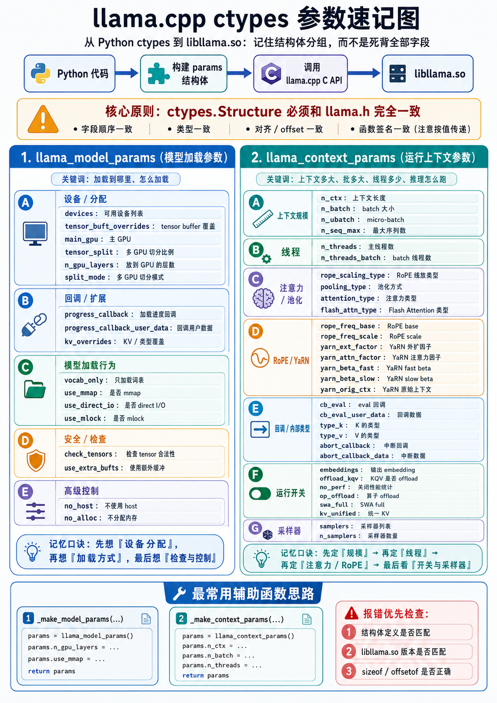

# llama.cpp ctypes 绑定：从 Wrapper 到直接调用

## 结论

为了将启动服务所需的参数字段，也就是context发送给llama.cpp服务，需要正确构建结构体。但是在这一过程中，**libllama_wrap.so 不是必需的**，也就是并不需要一个C函数来包裹。通过正确构建 ctypes 结构体，可以直接调用 llama.cpp 的 C API，无需编译 C wrapper。

这简化了分发：用户只需要预编译的 `libllama.so` / `libggml*.so`，不需要编译任何额外代码。

## 架构对比

### 旧方案：使用 C Wrapper

```
┌─────────────────────────────────────────────────────────────┐
│  Python (minicpmv_llama.py)                                  │
│  ┌─────────────────────────────────────────────────────────┐│
│  │  LlamaModel.__init__()                                  ││
│  │    ↓                                                     ││
│  │  _fn["model_load"](path, n_gpu_layers, use_mmap)        ││
│  │    ↓                                                     ││
│  │  ctypes → libllama_wrap.so                              ││
│  └─────────────────────────────────────────────────────────┘│
└─────────────────────────────────────────────────────────────┘
                              ↓
┌─────────────────────────────────────────────────────────────┐
│  C Wrapper (libllama_wrap.so)                                │
│  ┌─────────────────────────────────────────────────────────┐│
│  │  wrap_model_load(path, n_gpu_layers, use_mmap)          ││
│  │    ↓                                                     ││
│  │  llama_model_params params = llama_model_default_params()││
│  │  params.n_gpu_layers = n_gpu_layers                      ││
│  │  params.use_mmap = use_mmap                              ││
│  │    ↓                                                     ││
│  │  llama_model_load_from_file(path, params)                ││
│  └─────────────────────────────────────────────────────────┘│
└─────────────────────────────────────────────────────────────┘
                              ↓
┌─────────────────────────────────────────────────────────────┐
│  libllama.so (llama.cpp)                                     │
└─────────────────────────────────────────────────────────────┘
```

### 新方案：直接 ctypes 调用

```
┌─────────────────────────────────────────────────────────────┐
│  Python (minicpmv_llama.py)                                  │
│  ┌─────────────────────────────────────────────────────────┐│
│  │  LlamaModel.__init__()                                  ││
│  │    ↓                                                     ││
│  │  params = _make_model_params(n_gpu_layers, use_mmap)    ││
│  │    ↓                                                     ││
│  │  _fn["model_load"](path, params)                        ││
│  └─────────────────────────────────────────────────────────┘│
└─────────────────────────────────────────────────────────────┘
                              ↓
┌─────────────────────────────────────────────────────────────┐
│  libllama.so (llama.cpp)                                     │
│  ┌─────────────────────────────────────────────────────────┐│
│  │  llama_model_load_from_file(path, params)                ││
│  └─────────────────────────────────────────────────────────┘│
└─────────────────────────────────────────────────────────────┘
```

## ABI 兼容性要求

无论使用哪种方案，都需要确保 ABI 兼容：

```
┌─────────────────────────────────────────────────────────────┐
│                    ABI 兼容性检查                             │
├─────────────────────────────────────────────────────────────┤
│                                                             │
│  1. 结构体布局必须一致                                        │
│     ┌─────────────────────────────────────────────────────┐ │
│     │  llama_model_params (llama.h)                       │ │
│     │  ┌─────────────────────────────────────────────────┐│ │
│     │  │ devices: *void_p      (offset 0, size 8)       ││ │
│     │  │ tensor_buft: *void_p  (offset 8, size 8)       ││ │
│     │  │ n_gpu_layers: int32   (offset 16, size 4)      ││ │
│     │  │ split_mode: int32     (offset 20, size 4)      ││ │
│     │  │ ...                                           ││ │
│     │  └─────────────────────────────────────────────────┘│ │
│     │                                                     │ │
│     │  Python ctypes.Structure 必须完全匹配               │ │
│     └─────────────────────────────────────────────────────┘ │
│                                                             │
│  2. 函数签名必须一致                                         │
│     ┌─────────────────────────────────────────────────────┐ │
│     │  llama_model_load_from_file(                        │ │
│     │    const char * path,                               │ │
│     │    struct llama_model_params params  ← 按值传递     │ │
│     │  )                                                  │ │
│     └─────────────────────────────────────────────────────┘ │
│                                                             │
│  3. 库版本必须匹配                                           │
│     - libllama.so 版本 ↔ Python 结构体定义版本              │
│     - 不同版本的 llama.cpp 可能改变结构体字段                │
│                                                             │
└─────────────────────────────────────────────────────────────┘
```

## 结构体示例

### llama_model_params

```c
// llama.h 中的定义
struct llama_model_params {
    struct ggml_tensor *  * devices;           // offset 0
    struct ggml_backend_buft * tensor_buft_overrides; // offset 8
    int32_t               n_gpu_layers;        // offset 16
    enum llama_split_mode split_mode;          // offset 20
    int32_t               main_gpu;            // offset 24
    const float         * tensor_split;        // offset 32
    llama_progress_callback progress_callback; // offset 40
    void               * progress_callback_user_data; // offset 48
    const struct ggml_type_traits * kv_overrides; // offset 56
    bool                  vocab_only;          // offset 64
    bool                  use_mmap;            // offset 65
    bool                  use_direct_io;       // offset 66
    bool                  use_mlock;           // offset 67
    bool                  check_tensors;       // offset 68
    bool                  use_extra_bufts;     // offset 69
    bool                  no_host;             // offset 70
    bool                  no_alloc;            // offset 71
};
```

```python
# Python ctypes 对应定义
class llama_model_params(ctypes.Structure):
    _fields_ = [
        ("devices", ctypes.POINTER(ctypes.c_void_p)),           # offset 0
        ("tensor_buft_overrides", ctypes.POINTER(ctypes.c_void_p)), # offset 8
        ("n_gpu_layers", ctypes.c_int32),                        # offset 16
        ("split_mode", ctypes.c_int32),                          # offset 20
        ("main_gpu", ctypes.c_int32),                            # offset 24
        ("tensor_split", ctypes.POINTER(ctypes.c_float)),        # offset 32
        ("progress_callback", ctypes.c_void_p),                  # offset 40
        ("progress_callback_user_data", ctypes.c_void_p),        # offset 48
        ("kv_overrides", ctypes.POINTER(ctypes.c_void_p)),       # offset 56
        ("vocab_only", ctypes.c_bool),                           # offset 64
        ("use_mmap", ctypes.c_bool),                             # offset 65
        ("use_direct_io", ctypes.c_bool),                        # offset 66
        ("use_mlock", ctypes.c_bool),                            # offset 67
        ("check_tensors", ctypes.c_bool),                        # offset 68
        ("use_extra_bufts", ctypes.c_bool),                      # offset 69
        ("no_host", ctypes.c_bool),                              # offset 70
        ("no_alloc", ctypes.c_bool),                             # offset 71
    ]
```

### llama_context_params

```c
// llama.h 中的定义
struct llama_context_params {
    uint32_t              n_ctx;              // offset 0
    uint32_t              n_batch;            // offset 4
    uint32_t              n_ubatch;           // offset 8
    uint32_t              n_seq_max;          // offset 12
    int32_t               n_threads;          // offset 16
    int32_t               n_threads_batch;    // offset 20
    enum llama_rope_scaling_type rope_scaling_type; // offset 24
    enum llama_pooling_type pooling_type;     // offset 28
    enum llama_attention_type attention_type; // offset 32
    int32_t               flash_attn_type;    // offset 36
    float                 rope_freq_base;     // offset 40
    float                 rope_freq_scale;    // offset 44
    float                 yarn_ext_factor;    // offset 48
    float                 yarn_attn_factor;   // offset 52
    float                 yarn_beta_fast;     // offset 56
    float                 yarn_beta_slow;     // offset 60
    uint32_t              yarn_orig_ctx;      // offset 64
    float                 defrag_thold;       // offset 68
    ggml_backend_sched_eval_callback cb_eval; // offset 72
    void               * cb_eval_user_data;   // offset 80
    enum ggml_type        type_k;             // offset 88
    enum ggml_type        type_v;             // offset 92
    ggml_abort_callback   abort_callback;     // offset 96
    void               * abort_callback_data; // offset 104
    bool                  embeddings;         // offset 112
    bool                  offload_kqv;        // offset 113
    bool                  no_perf;            // offset 114
    bool                  op_offload;         // offset 115
    bool                  swa_full;           // offset 116
    bool                  kv_unified;         // offset 117
    struct llama_sampler * samplers;          // offset 120
    size_t                n_samplers;         // offset 128
};
```

```python
# Python ctypes 对应定义
class llama_context_params(ctypes.Structure):
    _fields_ = [
        ("n_ctx", ctypes.c_uint32),                              # offset 0
        ("n_batch", ctypes.c_uint32),                            # offset 4
        ("n_ubatch", ctypes.c_uint32),                           # offset 8
        ("n_seq_max", ctypes.c_uint32),                          # offset 12
        ("n_threads", ctypes.c_int32),                           # offset 16
        ("n_threads_batch", ctypes.c_int32),                     # offset 20
        ("rope_scaling_type", ctypes.c_int32),                   # offset 24
        ("pooling_type", ctypes.c_int32),                        # offset 28
        ("attention_type", ctypes.c_int32),                      # offset 32
        ("flash_attn_type", ctypes.c_int32),                     # offset 36
        ("rope_freq_base", ctypes.c_float),                      # offset 40
        ("rope_freq_scale", ctypes.c_float),                     # offset 44
        ("yarn_ext_factor", ctypes.c_float),                     # offset 48
        ("yarn_attn_factor", ctypes.c_float),                    # offset 52
        ("yarn_beta_fast", ctypes.c_float),                      # offset 56
        ("yarn_beta_slow", ctypes.c_float),                      # offset 60
        ("yarn_orig_ctx", ctypes.c_uint32),                      # offset 64
        ("defrag_thold", ctypes.c_float),                        # offset 68
        ("cb_eval", ctypes.c_void_p),                            # offset 72
        ("cb_eval_user_data", ctypes.c_void_p),                  # offset 80
        ("type_k", ctypes.c_int32),                              # offset 88
        ("type_v", ctypes.c_int32),                              # offset 92
        ("abort_callback", ctypes.c_void_p),                     # offset 96
        ("abort_callback_data", ctypes.c_void_p),                # offset 104
        ("embeddings", ctypes.c_bool),                           # offset 112
        ("offload_kqv", ctypes.c_bool),                          # offset 113
        ("no_perf", ctypes.c_bool),                              # offset 114
        ("op_offload", ctypes.c_bool),                           # offset 115
        ("swa_full", ctypes.c_bool),                             # offset 116
        ("kv_unified", ctypes.c_bool),                           # offset 117
        ("samplers", ctypes.POINTER(ctypes.c_void_p)),           # offset 120
        ("n_samplers", ctypes.c_size_t),                         # offset 128
    ]
```

## 辅助函数

为了简化结构体构建，添加了辅助函数：

```python
def _make_model_params(n_gpu_layers=99, use_mmap=True):
    """构建 llama_model_params 结构体"""
    params = llama_model_params()
    params.n_gpu_layers = n_gpu_layers
    params.use_mmap = use_mmap
    # ... 设置其他字段
    return params

def _make_context_params(n_ctx=4096, n_batch=512, ...):
    """构建 llama_context_params 结构体"""
    params = llama_context_params()
    params.n_ctx = n_ctx
    params.n_batch = n_batch
    # ... 设置其他字段
    return params
```

## 测试结果

### MiniCPM-V-GGUF

```bash
Mode: 3D-Resampler (packing=1)
7 frames, max_slice_nums=1, packing=1 → 7 packages × 64 = 448 visual tokens (6.0s)
Loading GGUF: .../MiniCPM-V-4_5-Q4_K_M.gguf
  n_embd=4096, n_vocab=151748
All tests done. 1 passed.
```

## 分发建议

### 旧方案（需要编译 wrapper）

```bash
# 用户需要：
# 1. llama.cpp 源码（头文件）
# 2. 编译好的 llama.so / ggml.so
# 3. 编译 wrapper
gcc -shared -fPIC -o bin/libllama_wrap.so bin/llama_wrap.c \
  -I/path/to/llama.cpp/include \
  -L/path/to/llama.cpp/build/bin -lllama -lggml
```

### 新方案（无需编译）

```bash
# 用户只需要：
cp -a /path/to/llama.cpp/build/bin/libllama.so* bin/
cp -a /path/to/llama.cpp/build/bin/libggml*.so* bin/

# 直接运行
python 04-Verify-Video.py sample_video.mp4 ...
```
## 出错时优先看这里

如果出现这些问题：

```text
ctypes.ArgumentError: argument 2: TypeError: expected llama_model_params instance instead of int
Failed to create context
segmentation fault
```

优先检查：

1. **结构体布局是否匹配**：Python ctypes 定义必须与 llama.h 完全一致
2. **库版本是否匹配**：libllama.so 版本必须与 Python 结构体定义版本一致
3. **字段偏移是否正确**：使用 `ctypes.sizeof()` 和 `ctypes.offsetof()` 验证

```bash
# 检查结构体大小
python3 -c "from minicpmv_llama import llama_model_params; print(ctypes.sizeof(llama_model_params))"

# 检查字段偏移
python3 -c "from minicpmv_llama import llama_model_params; print(ctypes.offsetof(llama_model_params, 'n_gpu_layers'))"
```
